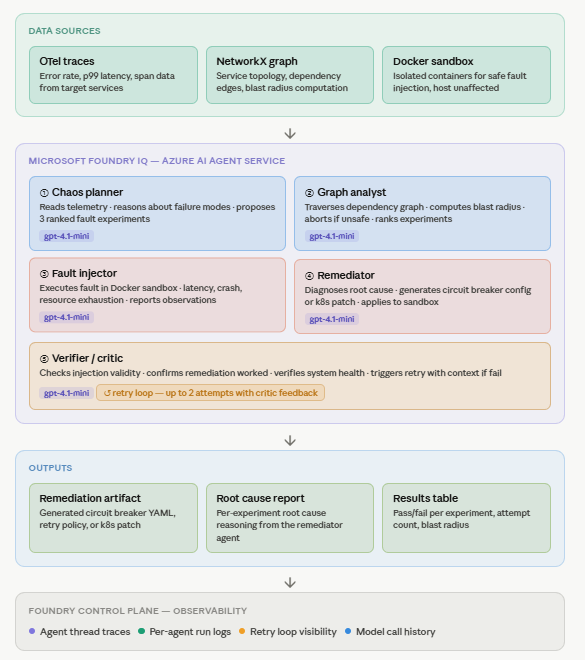

# ChaosProof

> Automated chaos engineering via multi-agent reasoning on Microsoft Foundry IQ.

## Microsoft IQ Integration
Built on **Foundry IQ** via Azure AI Foundry Agent Service.
All five reasoning agents are orchestrated through Azure AI Agent Service
using GPT-4.1-mini, with full observability through Foundry's agent tracing.

## Track
Microsoft Agents League Hackathon — **Reasoning Agents track**

---

## What It Does

ChaosProof is an autonomous chaos engineering platform powered by Microsoft Foundry IQ multi-agent reasoning.

Unlike traditional chaos engineering tools (Chaos Monkey, LitmusChaos) that execute predefined failures,
ChaosProof **reasons** about the current state of the system before acting.

The system:
- Reads live telemetry and traces from distributed services
- Builds a service dependency graph and computes blast radius
- Plans safe chaos experiments automatically — aborts if blast radius is too large
- Executes fault injections in a sandboxed Docker environment
- Generates concrete remediation artifacts (circuit breaker configs, k8s patches)
- Validates recovery through a critic loop — retries with feedback if recovery fails

---

## The Five Agents

| Agent | Model | Role |
|---|---|---|
| **Chaos Planner** | gpt-4.1-mini | Reads telemetry, proposes 3 ranked fault experiments |
| **Graph Analyst** | gpt-4.1-mini | Computes blast radius, ranks experiments safest-first |
| **Fault Injector** | gpt-4.1-mini | Simulates latency, crash, resource exhaustion in sandbox |
| **Remediator** | gpt-4.1-mini | Diagnoses root cause, generates fix config |
| **Verifier / Critic** | gpt-4.1-mini | Checks recovery, triggers retry loop if fail |

Each agent reasons from the previous agent's output — this is a genuine multi-step reasoning chain, not a pipeline.

---

## Architecture



---

## Getting Started

### 1. Create Foundry project
1. Go to https://ai.azure.com
2. Create a new project
3. Deploy **gpt-4.1-mini** model
4. Copy the project endpoint URL

### 2. Install dependencies
```bash
# Windows
python -m venv .venv
.venv\Scripts\activate

# Mac/Linux
python -m venv .venv
source .venv/bin/activate

pip install -r requirements.txt
```

### 3. Configure credentials
```bash
cp .env.example .env
# Edit .env — add AZURE_PROJECT_ENDPOINT
az login   # handles auth automatically
```

### 4. Create the five agents (run once)
```bash
python main.py --setup
# Prints five agent IDs — paste them into .env
```

### 5. Run ChaosProof
```bash
python main.py --service order-service
python main.py --service payment-service
```

---

